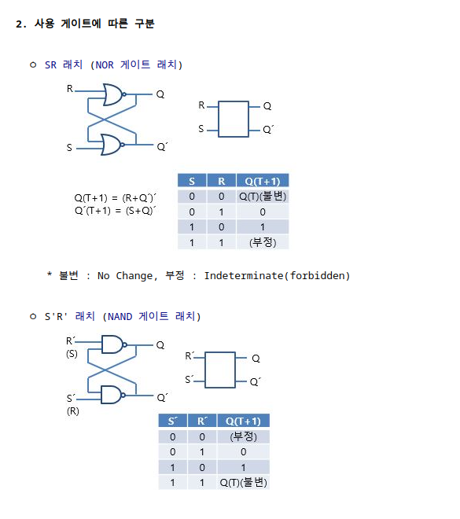

# 메모리와 디스크의 핵심 

## 순차논리

- 순차논리: 시간적으로 어떤 값 뒤에 오는 다른 값.
    - 조합 논리는 입력의 현재 상태만을 다룬다. 하지만 순차논리는 입력의 현재 상태와 과거 상태를 함께 고려한다.
## 피드백

- 피드백 회로는 인풋에 해당하는 전기적 신호가 아웃풋을 만들어 냄과 동시에, 아웃풋이 인풋에 다시 영향을 주는 회로
- 이로 인해 출렦이 0과 1사이를 진동한다.(발진자)
- 진동이 일어날 수 있는 계(系)는 어느 것이나 진동자/발진자 라고 지칭
- 이러한 진동을 이용하여 시간을 표현할 수 있다. 주기적으로 운동을 하기 때문이다.
- 좀 더 정확한 발진자를 만드는방법은 크리스탈을 활용하는 방법이다.

## 클록

- 클럭은 1초 동안 파장이 한 번 움직이는 시간을 의미한다.
- 발진자는 컴퓨터에 클록을 제공한다.ㅏ
- 컴퓨터 클록은 밴드에서 드러머가 박자를 맞춰 드럼을 치는 것 과 같다. 
- 클럭은 회로의 페이스를 결정한다.(특정 거리를 달리는데 소요되는 시간) -> 회로을 이동하는 걸리는 시간


## 래치
- 클럭 입력을 갖지 않는 2진 기억소자 (쌍안정회로)
- `기억` 및 `귀환` 요소가 있으므로, 플립플롭과 유사하나, `클럭` 입력이 없으므로, 비동기식 순서논리회로 소자 임

- 특징
  - 2개 용도 가능
  . 입력되는 펄스를 래치(걸어잠금,latch up,latching)하거나,
  . 기억/저장이 가능
  - 통상, 짝수 개의 반전형 소자들이 맞물리어 구성 (아래 3.항 래치의 종류 참조)

- S-R 래치
  - S(set) 및 R(reset)으로된 2개의 입력과 Q 및 Q′으로된 2개의 출력으로 구현
- 

## 플립플롭

- 에지: 논리 수준이 한 수준에서 다른 수준으로 전이되는 중간에 데이터를 잡아 내는 것
- 에지(클럭)에 의해 데이터 변화가 촉발되는 래치를 플립플롭 이라고 부른다.

- D플립플롭
  - 양의 에지에 의해 변화가 촉발되는 플립플롭
  - 0에서 1로 바뀌는 순간에 플립플롭의 출력이 변경된다. 이를 D플립플롭이라고한다.

## 카운터

- 미리 정해진 상태천이 순서를 순환하면서 클럭 펄스의 수를 카운트하는 소자(장치)이다.
- 플립플롭을 응용한 회로로써 1,2,3,순서대로 수를 센다.

## 레지스터

- 클록을 공유하는 여러 D플립플롭을 한 패키지에 넣은 것.
- 레지스터란 워드 단위의 데이터를 저장하거나 처리하기 위해 다수의 플립플롭을 연결하여 소수의 게이트로 제어하는 소규모 단위의 기억 장치로 데이터나 명령을 일시적으로 저장하거나 이동시키는 역할을 수행하며 추가적으로 직렬 혹은 병렬로 입. 출력 동작을 수행한다.
- D플립플롭을 사용하면 값을 쉽게 기억할 수 있는데. 이걸 이용하여 여러가지의 수를 기억하여 계산를 할 수 있다. 

## 메모리조직과 주소 지정
 
- 많은 정보를 저장하기 위해서는 레지스터를 많이 쌓아두는 것부터 시작한다.
  - 레지스터를 사용하면 여러 비트를 저장할 수 있기 떄문이다. 이전의 정보들을 기억하기 유용하다.

```
레지스터를 많이 쌓아두면 어떤 레지스터에 어떤 입력을 넣고 어떻게 출력을 선택할 지 의 문제가 생긴다.
레지스터의 입력이 들어오면 결과는 여러가지가 나올 수 있기 떄문이다.
이 때 디코더와 실렉터를 이용하여 문제를 해결할 수 있다.
디코더의 출력을 레지스터의 입력을 홠헝화 하기 위해 사용하고, 실렉터를 이용하여 출력을 선택할 수 있다.
```

- 이 모든 요소를 한데 합하면 엄창난 입력과 출력을 관리해야 한다. (레지스터의 수많은 출력과 디코더의 수많은 출력들을 하나로 표현하기 떄문에??)
  - 하드웨어 설계자들은 메모리를 동시에 릭고 쓸 필요가 있는 경우는 거의 없다는 사실을 활용하여 연결을 줄였다.
    - 입력과 출력 데이터 연결을 합치고 enable제어 신호를 이용하여 메모리 전체를 켜거나 꺼서 여러 메모리 칩을 함께 연결할 수 있게 해준다.
    - 책의 있는 주소와 데이터에는 개별 신호 대신 큰 화살표를 사용한 것을 볼 수 있다. (그림3-21,149쪽) 이런 식으로 연관된 신호를 버스라고 부른다. (주소버스 데이터 버스)


### 메모리 칩 내부 관리

- 기존에는 헹과 열로 두덩어리로 나누어 관리했다.  메모리 내부위치는 열과 행을 조합해 지정된다.

- 멀티 플렉싱함면 주소 라인의 수를 반으로 줄일 수 있다.
  - 멀티 플렉싱(다중화 행과 열의 입력을 하나의 신호로 합하여 보내준다??)
  - 중간에 멀티 플렉싱한 주소를 저장하기 위한 레지스터를 납둔다.

### 임의 접근 메모리

- RAM(Ra/ndom access memory 임의 접근 메모리)를 사용하면 메모리 위치 중 원하는 곳은 어디든 원하는 순서로 쓰거나 읽을 수 있다.

- 정적RAM은 SRAM(Static) 비싸지만 아주 빠르다. 각 비트에 트랜지스터가 6개 들어간다.
  - 트랜지스터는 공간을 차지하기 떄문에 SRAM은 수십억~수조 비트를 저장하기에 좋은 선택은 아니다. 

- 동적(Dynamic)램은  도 교묘한 방법을 사용하낟. 커패시터라는 아주 작은 버킷에 전자를 담고 트랜지스터를 1개만 사용해 뚜겅을 덮는다. 문제는 이 버킷이 새기 때문에 가끔 메모리를 갱신 해야한다.(Refresh) 즉 버킷에 주기적으로 전자를 다시 채워 넣어야 한다는 말이다.
  - 버킷에 전자를 채우는 시점과 버킷에 정보를 쓰는 시간이 서로 겹치지 않게 조심해야 한다.
  - Dram은 집적도(밀도, 단위 면적당 비트 개수) 가 높기 때문에 큰 메모리 칩에 사용된다.
    - 큰 메모리 칩이라는 말은 주소가 더 많다는 뜻이고, 그에 따라 멀티플렉싱 방식을 사용해야한다.

```
프로그래밍에서는 함께 사용되는 요소들을 같은 행에 넣어두면 성능이 훨씬 좋아진다.(한번 찾아보기)
SRAM이나 DRAM은 모두 휘발성 메모리다. (전원이 끊어지면 데이터가 사라진다.) 코어 메모리는 오래도니 비휘발성 RAM으로 비트를 토러스 모양의 쇳조각에 저장한다. 

```


## 읽기 전용 메모리

- 읽기 전용 메모리(Read only memory -> ROM이라는 좋지 못한 이름 대신  한번만 쓸 수 있는 메모리라고 불러야 한다) 
- Rom은 한 번 쓰고 나면 여러 번 읽을 수 있다. 전자레인지 같이 프로그램을 내장해야 하는 장치에서 ROM이 유용하다.
  - 한번 만들고 여러번 사용하면 되니깐

```
일긱 전용 메모리는 처음에 오류가 난 프로그래밍을 그대로 rom에 저장했을 경우 많은 에러를 발생시켰다.
그래서 시간이 지나면서 ram과 비슷한 형태로 진화했다. 결국 ROM을 대신하여 RAM을 사용한다.
```
## 블록 장치

- 하나의 대용량 창고 같은 느낌이다. 굳이 멀리가서 매일 조금씩 사오는 것보단 가까운 위치에 창고를 둬서 그곳에서 자원을 이동하는게 더욱 효율적이다.
- 블록은 역사적으로 섹터라고 불려왔고, 디스크에서 읽고 쓰기가 가능한 가장 작은 단위이다.
- 디스크 드라이브는 다른 유형의 메모리에 비해 상대적으로 느리다. 디스크는 정보를 읽을 때 디스크판에 있는 비트를 회전하여 얻을 수 있따. 이 때 다시 원하는 비트를 다시 조회할 때는 한바퀴를 더 돌아야하는데 그속도가 RAM에 비해 느리다.


## 플래시 메모리와 SSD

- 플래시 메모리는 가장 최근 나타난 EEPROM유형의(전기를 이용한 ROM방식) 하나이다. 
- 플래시 메모리는 DRAM과 마찬가지로 버킷에 전자를 담는 방식으로 작동한다. 하지만 플래시 메모리의 버킷은 DRAM보다 더 크고 잘 만들어져 있어서 전자가 새지 않는다.
- 플래시 메모리는 RAM처럼 원하는 위치를 마음대로 읽을 수 있따. 하지만 빈 플래시 메모리에 데이터를 기록하기 위해서는 먼저 0을 채워 넣어야 한다. 플래시 메모리의 0을 1로 바꿀 수는 있지만, 전체를 지우지 않고 원하는 비트만 0으로 되도릴 수 없다. 모든 메모리를 다 지우는 것은 낭비가 심하므로 플래시 메모리 내부는 블록으로 나눠서 블록 단위로 지우고 값을 쓸 수 있다. 
  - 플래시 메모리는 읽을 때는 임의 접근장치이고 (원하는 위치를 읽을 수 있따.) 쓸때는 블록접근(블록 단위로 접근)장치이다.

- 디스크 드라이브는 점차 SSD(고체 상태 드라이브)로  교체되고 있다.SSD는 디스크 드라이브 모양의 패키지에 넣은 플래시 메모리와 같다. 현재는 회전식 하드 디스크보다 SSD의 비트당 가격이 비싸지만 SSD가격이 점차 저렴해지고 있다. 

### 오류 감지와 정정
- 원본데이터가 오류가 있는지 없는지 검증하는 방법이 있다.

#### 페라티
- 페라티를 사용하면 단 1비트만 데이터가 잘못된 경우를 감지할 수 있다. 
  - 데이터에서 1로 설정된 비트의 개수를 세고 , 그 개수가 짝수인지 홀수인지 나타내는 1비트를 데이터에 덧붙이는 것이다.

#### 체크섬
- 데이터의 각 지점을 n 비트값으로 더하고 n비트를 넘어가는 값은 무시한다. 

#### 순환 중복 검사.
- 데이터가 약간이라도 바뀌면 검증 숫자가 더 이상 일치하지 않게 만드는 기술.

## 하드웨어와 소프트웨어 비교
- 논리 회로는 컴퓨터 하드웨어 만드는곳 뿐만 아니라 소프트웨어만들 때 코드에도 들어가기 떄문에 하드웨어와 소프트웨어에서의 논리 만드는차이는 상당히 모호하다.