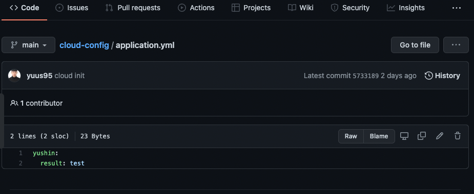

## Cloud Config  적용하는 간단한 방법 정리하기


-  개요
```
Spring Cloud Config provides server-side and client-side support for externalized configuration in a distributed system. With the Config Server, you have a central place to manage external properties for applications across all environments. The concepts on both client and server map identically to the Spring Environment and PropertySource abstractions, so they fit very well with Spring applications but can be used with any application running in any language. As an application moves through the deployment pipeline from dev to test and into production, you can manage the configuration between those environments and be certain that applications have everything they need to run when they migrate. The default implementation of the server storage backend uses git, so it easily supports labelled versions of configuration environments as well as being accessible to a wide range of tooling for managing the content. It is easy to add alternative implementations and plug them in with Spring configuration.

Spring Cloud Config는 분산 시스템에서 외부화된 구성에 대한 서버 측 및 클라이언트 측 지원을 제공합니다. Config 서버를 사용하면 모든 환경에서 애플리케이션의 외부 속성을 중앙에서 관리할 수 있습니다. 클라이언트와 서버의 개념은 모두 Spring Environment 및 PropertySource 추상화와 동일하게 매핑되므로 Spring 응용 프로그램과 매우 잘 맞지만 모든 언어로 실행되는 응용 프로그램에서 사용할 수 있습니다. 애플리케이션이 개발에서 테스트로, 운영으로 배포 파이프라인을 통해 이동할 때 이러한 환경 간의 구성을 관리하고 마이그레이션 시 애플리케이션이 실행하는 데 필요한 모든 사항을 갖추도록 할 수 있습니다. 서버 스토리지 백엔드의 기본 구현은 git을 사용하므로 레이블링된 버전의 구성 환경을 쉽게 지원할 뿐만 아니라 컨텐츠 관리를 위한 다양한 툴링에 액세스할 수 있습니다. 대체 구현을 추가하고 Spring 구성을 통해 간편하게 연결할 수 있습니다.

```

한마디로 Spring Cloud Config를 사용하면 분산 시스템에서 외부화된 구성요소들을 중앙에서 한번에 관리할 수 있다.


- Config Server

```

Spring Cloud Config Server provides an HTTP resource-based API for external configuration (name-value pairs or equivalent YAML content). The server is embeddable in a Spring Boot application, by using the @EnableConfigServer annotation. Consequently, the following application is a config server:


Spring Cloud Config Server는 외부 구성(이름-값 쌍 또는 이와 동등한 YAML 콘텐츠)을 위한 HTTP 리소스 기반 API를 제공합니다. 서버는 @EnableConfigServer 주석을 사용하여 Spring Boot 애플리케이션에 내장할 수 있습니다. 따라서 다음 응용 프로그램은 구성 서버입니다.
```

- Cloud Config 내용을 HTTP리소스 기반 API로 제공할 수 서버 


## 간단한 Cloud Config & Server만들기

### Spriong Cloud Config
- 임의의 Git Repository 만들고 간단한 yml파일 만들기
   


### Cloud Server만들기

```
//build.gradle.kts
    implementation("org.springframework.cloud:spring-cloud-config-server:3.0.6")

//application.yml

spring:
  profiles:
    active: native
---
server:
  port: 8888

# 로컬 사용할 경우 프로필명은 꼭 native사용하기
spring:
  profiles: native
  cloud:
    config:
      server:
        native:
          search-locations: yml 로컬주소 
            # ex) ~/cloud-config()

---
# git Repo 사용
spring:
  profiles: git
  cloud:
    config:
      server:
        git:
          uri: 깃 레포지 주소
          # ex) https://github.com/yuus95/cloud-config 

// Application main

@EnableConfigServer 어노테이션 추가하기
```